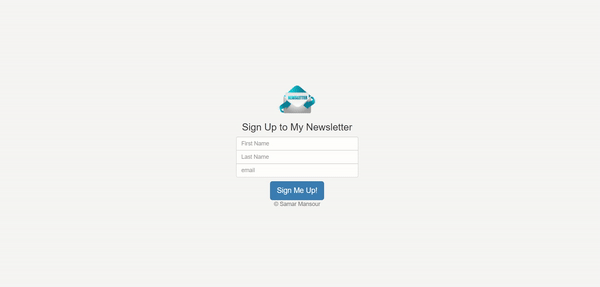

# Newletter-Signup

- [About this project](#about)
- [Features](#features)
- [Requirements](#requirements)
- [Technical Information](#technical_information)

## About
In this project, it shows how to upload your project in Heroku.

## Features
- [x] HTML
- [x] NodeJs
- [x] Javascript
- [x] Heroku
- [x] Bootstrap

## Requirements
- HTML
- Bootstrap
- Javascript
- NodeJs
- Heroku

## Technical Information

To run the site on your local machine

1. Download or clone the repository onto your machine.
2. Extract the .zip file.
3. Open .html file in your browser.
4. You can visit the project in this Link: https://evening-caverns-95682.herokuapp.com/

