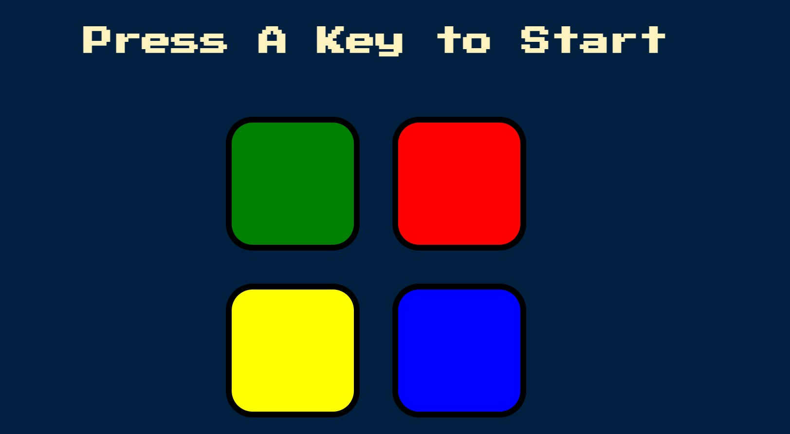

# HTML/CSS/JS/ajax & DOM - Simon Game

- [About this project](#about)
- [Features](#features)
- [Requirements](#requirements)
- [Technical Information](#technical_information)

## About
In this code along I updated the provided starter files using
HTML, CSS, ajax, and Javascript

## Features
- [x] HTML
- [x] CSS
- [x] Javascript
- [x] ajax

## Requirements
- HTML
- CSS
- Javascript
- ajax

## Technical Information

To run the site on your local machine

1. Download or clone the repository onto your machine.
2. Extract the .zip file.
3. Open .html file in your browser.

